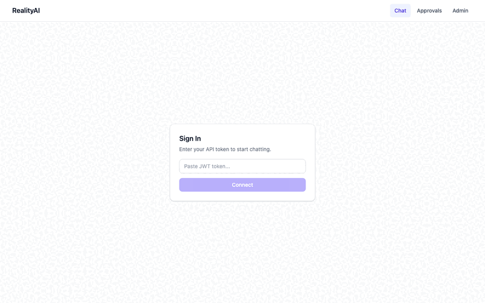
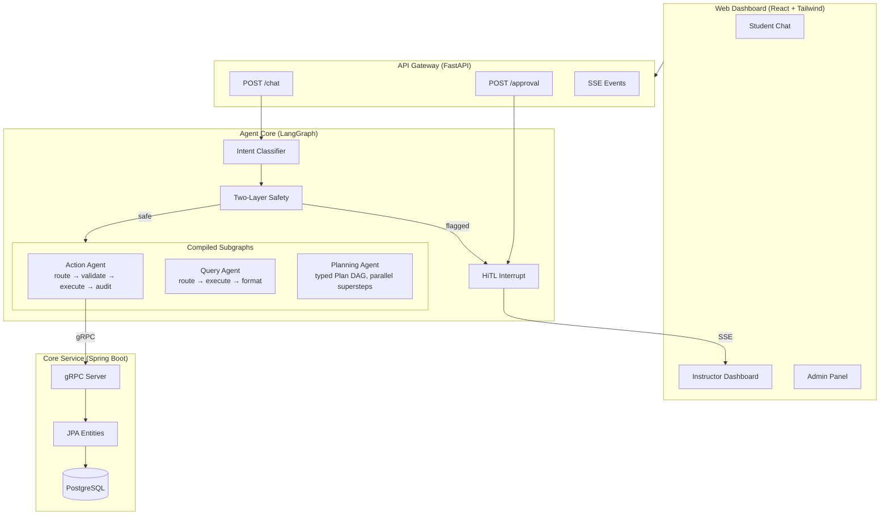

# RealityAI Multi-Agent System

A course-management assistant for higher education, built around a multi-agent
LangGraph orchestrator with typed plan-DAG execution, two-layer safety, and
human-in-the-loop approval. The reasoning layer is the focus of this
repository; data ingestion lives separately (see [Attribution](#attribution)).

## Demo



*Student chat → safety flag → instructor approval → admin panel*

## Architecture



For the full topology — plan-DAG executor, subgraph nodes,
symbolic-vs-LLM placement — see [`docs/architecture.md`](docs/architecture.md).

## Cross-agent design decisions

Four ADRs document the load-bearing architectural choices. Each is
under 300 words.

| ADR | Decision | One-line rationale |
|---|---|---|
| [001](docs/adr/001-typed-discriminated-union-over-dict.md) | Typed discriminated outputs over generic dicts | Avoid double-LLM-inference at dispatch and re-parse hallucination at step boundaries |
| [002](docs/adr/002-state-list-with-reducer-for-parallel-results.md) | Reducer-equipped state for parallel plan-step writes | LangGraph runs sibling nodes in one superstep; reducers + AND-join `add_edge` are required for correctness |
| [003](docs/adr/003-subgraph-internal-state-isolation.md) | Subgraph internal-state isolation | Sub-agent working memory does not pollute parent state or LangSmith trace |
| [004](docs/adr/004-llm-symbolic-hybrid-reasoning.md) | LLM at the ends, symbolic in the middle | Set diff, interval overlap, and CSP are deterministic algorithms, not LLM jobs |

## Attribution

This is a team project. The split is explicit:

- **Reasoning layer (this repo's `agent-core/`)** — multi-agent orchestration,
  typed plan DAG, retrieval pipeline shape, safety wiring, evaluation harness.
- **Data layer (`core-service/` Spring Boot side)** — JPA entities, PDF
  extraction for degree requirements, course catalog JSON normalization,
  ingestion edge cases (cross-listed courses, TBA instructors, prereq
  parsing). Owned by a teammate.

The contract between the two layers is the typed Pydantic models in
`agent-core/schemas/` and the gRPC proto in `proto/`. Schema co-design,
implementation each-own.

## Tech stack

| Service | Language | Framework | Port |
|---------|----------|-----------|------|
| API Gateway | Python | FastAPI | 8000 |
| Agent Core | Python | LangChain / LangGraph | (internal) |
| Core Service | Java | Spring Boot + gRPC | 8080 / 9090 |
| Web Dashboard | TypeScript | React + Vite + Tailwind | 3000 |

## What is and isn't wired

| Subsystem | Status |
|---|---|
| Multi-agent orchestration | Wired |
| Typed Plan DAG with parallel execution | Wired |
| Subgraph internal-state isolation | Wired |
| Two-layer safety + HiTL | Wired |
| Query rewrite Layer 1 (coref resolver + regex gate) | Wired |
| Query rewrite Layer 2 (PlanStep `semantic_query` / `query_expansion`) | Wired |
| Hybrid retrieval (RRF + vector + keyword) | Pipeline wired; **data source is mock** |
| ChromaDB | **Not wired** — mock keyword-overlap stub |
| PostgreSQL (direct from agent-core) | **Not wired** — Spring Boot uses Postgres via gRPC |
| Redis cache | **Not wired** — in-memory dict |
| Spring Boot core service (gRPC) | Wired |
| Canvas / live data | Not wired — mock transcripts in `agents/query_agent.py` |

Mocks return typed Pydantic objects matching the production contract, so
swapping in a real source only changes data origin.

## Quick start

```bash
git clone git@github.com:C-byChloe/realityai-agents.git
cd realityai-agents
cp .env.example .env
# Edit .env — set ANTHROPIC_API_KEY at minimum

docker compose up --build
open http://localhost:3000
```

### Without Docker

```bash
docker compose up -d postgres
cd agent-core && pip install ".[dev]" && cd ..
cd api-gateway && pip install -r requirements.txt && cd ..

cd agent-core && python cli.py "What time does CS101 meet?"
cd api-gateway && uvicorn main:app --reload
```

## Project structure

```
realityai-agents/
├── agent-core/           # LangGraph state machine, agents, safety, retrieval, caching
│   ├── agents/           # Action, Query, Planning + degradation
│   ├── schemas/          # PlanStep, query outputs, solver — typed contracts
│   ├── reasoning/        # ConstraintSolver, gap analysis (symbolic, no LLM)
│   ├── safety/           # Two-layer safety (static + dynamic) with OR merge
│   ├── retrieval/        # Hybrid retrieval (RRF over vector + keyword, mocked)
│   ├── caching/          # Response/prompt cache, invalidation
│   ├── evaluation/       # Eval harness, ground truth, baseline_metrics.json
│   ├── observability/    # LangSmith tracing
│   └── tests/            # 308 unit tests + 14 gRPC integration
├── api-gateway/          # FastAPI: JWT auth, rate limiting, SSE, chat, approvals
├── core-service/         # Spring Boot: JPA entities, gRPC, PostgreSQL  (teammate)
├── web-dashboard/        # React 19 + TypeScript + Tailwind
├── proto/                # gRPC contract: course, student, assignment
├── docs/
│   ├── architecture.md   # Full topology and dispatch flow
│   └── adr/              # 4 architecture decision records
└── docker-compose.yml
```

## Evaluation

Eval harness, methodology, and a checked-in baseline live in
[`agent-core/evaluation/`](agent-core/evaluation/). Run it:

```bash
cd agent-core
python -m evaluation.run     # regenerates baseline_metrics.json
```

Read [`evaluation/README.md`](agent-core/evaluation/README.md) before
quoting any number — the limitations section is the honest part.
The mock retrieval universe is 10 documents, so vector and hybrid
saturate at 100% P@5/R@5; the eval cannot differentiate retrieval
techniques on this corpus. Methodology generalizes; the numbers don't.

## Configuration

All configuration via environment variables. See
[`.env.example`](.env.example) for the full list.

| Variable | Required | Description |
|----------|----------|-------------|
| `ANTHROPIC_API_KEY` | Yes | Claude API key |
| `JWT_SECRET_KEY` | Yes (prod) | JWT signing |
| `LANGSMITH_TRACING` | No | Enable LangSmith |
| `RATE_LIMIT_RPM` | No | Per-user RPM (default: 60) |

## Development

```bash
cd agent-core && pytest --ignore=tests/test_grpc_client.py
cd agent-core && python -m evaluation.run
cd api-gateway && pytest tests/ -v
cd web-dashboard && npm run build

ruff check agent-core/ api-gateway/
cd web-dashboard && npm run lint
```

## License

MIT
