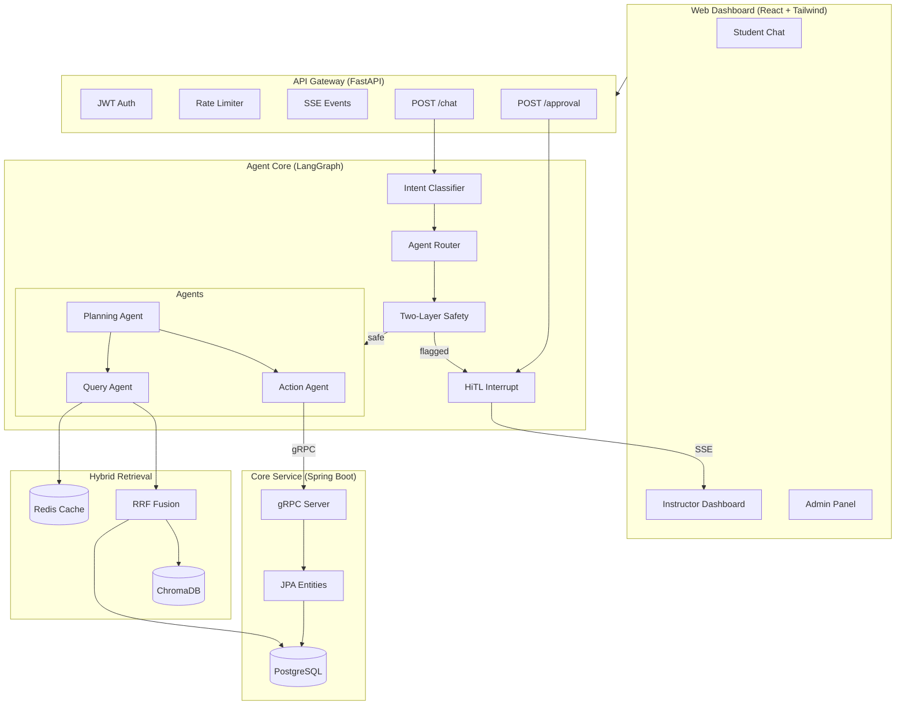

# RealityAI Multi-Agent System

An AI-powered course management assistant for Higher Education, built around a multi-agent orchestration system with two-layer safety controls, hybrid retrieval, and production-grade cost optimization.

## Architecture



## Tech Stack

| Service | Language | Framework | Port |
|---------|----------|-----------|------|
| API Gateway | Python | FastAPI | 8000 |
| Agent Core | Python | LangChain / LangGraph | (internal) |
| Core Service | Java | Spring Boot + gRPC | 8080 / 9090 |
| Web Dashboard | TypeScript | React + Vite + Tailwind | 3000 |

| Data Store | Purpose |
|------------|---------|
| PostgreSQL | Relational data (courses, students, enrollments, assignments) |
| ChromaDB | Vector embeddings for RAG retrieval |
| Redis | Response cache (TTL-based), session state |

## Quick Start

```bash
# 1. Clone and configure
git clone git@github.com:C-byChloe/realityai-agents.git
cd realityai-agents
cp .env.example .env
# Edit .env — set ANTHROPIC_API_KEY at minimum

# 2. One-click startup (Docker)
docker compose up --build

# 3. Access the dashboard
open http://localhost:3000
```

### Without Docker

```bash
# Start infrastructure
docker compose up -d postgres chromadb redis

# Install Python deps
cd agent-core && pip install ".[dev]" && cd ..
cd api-gateway && pip install -r requirements.txt && cd ..

# Run the CLI test harness
cd agent-core && python cli.py "What time does CS101 meet?"

# Or start the API gateway
cd api-gateway && uvicorn main:app --reload
```

## Project Structure

```
realityai-agents/
├── agent-core/           # LangGraph state machine, agents, safety, retrieval, caching
│   ├── agents/           # Action, Query, Planning agents + degradation
│   ├── safety/           # Risk classifier, intent analyzer, merge logic
│   ├── retrieval/        # Hybrid retrieval with RRF fusion
│   ├── caching/          # Response cache, prompt cache, invalidation
│   ├── evaluation/       # Ground truth dataset, precision harness, E2E runner
│   ├── observability/    # LangSmith tracing integration
│   └── tests/            # Unit + integration + E2E tests (58 scenarios)
├── api-gateway/          # FastAPI: JWT auth, rate limiting, SSE, chat, approvals
├── core-service/         # Spring Boot: JPA entities, gRPC handlers, PostgreSQL
├── web-dashboard/        # React 19 + TypeScript + Tailwind: chat, approvals, admin
├── proto/                # Protocol Buffer definitions (course, student, assignment)
├── .github/workflows/    # CI: lint → test → build
└── docker-compose.yml    # Production orchestration (7 services)
```

## Key Features

### Multi-Agent Orchestration
- **Intent Classification** — LLM-based router classifies to action/query/planning
- **Action Agent** — Grade updates, enrollment changes, assignment creation via gRPC
- **Query Agent** — Hybrid retrieval (vector + keyword + RRF fusion) with response caching
- **Planning Agent** — Multi-step task decomposition with sub-agent delegation

### Two-Layer Safety System
- **Static Risk Classifier** — Tool-level risk mapping, <1ms, default-to-high policy
- **Dynamic Intent Analyzer** — LLM-based detection of bulk ops, scope mismatch, adversarial intent
- **OR Merge Policy** — Either layer flagging triggers human-in-the-loop review

### Human-in-the-Loop (HiTL)
- Safety-flagged operations interrupt the pipeline
- SSE push notifies instructors in real-time
- Approve/reject via dashboard with full agent context
- Pipeline resumes or terminates based on decision

### Cost Optimization
- **Response Cache** — Redis-backed with TTL, deterministic query deduplication
- **Prompt Cache** — Anthropic cache_control breakpoints for static system prompts
- **Graceful Degradation** — Retry with simplified prompt → instructor escalation

## Metrics

| Metric | Target | Measurement |
|--------|--------|-------------|
| Context Precision | ≥ 0.7 | Relevant docs in top-5 / total docs in top-5 |
| Task Completion Rate | ≥ 90% | E2E scenarios passing (currently 58/58 = 100%) |
| Cache Hit Rate | Tracked | Redis cache hits / total deterministic queries |
| SSE Latency | < 200ms | Time from event push to client receipt |
| Safety Classification | < 1ms | Static risk classifier execution time |

## Configuration

All configuration is via environment variables. See [`.env.example`](.env.example) for the full list:

| Variable | Required | Description |
|----------|----------|-------------|
| `ANTHROPIC_API_KEY` | Yes | Claude API key for LLM inference |
| `JWT_SECRET_KEY` | Yes (prod) | Secret for JWT token signing |
| `DB_USERNAME` / `DB_PASSWORD` | No | PostgreSQL credentials (default: realityai) |
| `LANGSMITH_TRACING` | No | Enable LangSmith observability (true/false) |
| `RATE_LIMIT_RPM` | No | Per-user requests per minute (default: 60) |

## Development

```bash
# Run all Python tests
cd agent-core && pytest tests/ -v

# Run E2E scenario suite with JSON report
cd agent-core && python -m evaluation.e2e_runner

# Run API gateway tests
cd api-gateway && pytest tests/ -v

# Run frontend type check and build
cd web-dashboard && npm run build

# Lint
ruff check agent-core/ api-gateway/
cd web-dashboard && npm run lint
```

## License

MIT
